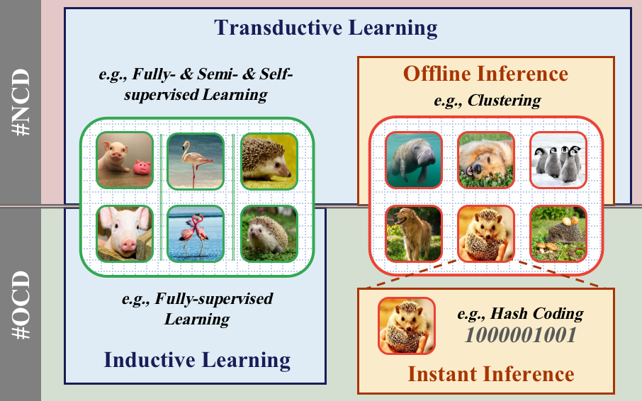

# On-the-fly-Category-Discovery
Code release for "On-the-fly Category Discovery" (CVPR 2023）



**Abstract**: Although machines have surpassed humans on visual recognition problems, they are still limited to providing closed-set answers. Unlike machines, humans can cognize novel categories at the first observation. Novel category discovery (NCD) techniques, transferring knowledge from seen categories to distinguish unseen categories, aim to bridge the gap. However, current NCD methods assume a transductive learning and offline inference paradigm, which restricts them to a pre-defined query set and renders them unable to deliver instant feedback. In this paper, we study on-the-fly category discovery (OCD) aimed at making the model instantaneously aware of novel category samples (i.e., enabling inductive learning and streaming inference). We first design a hash coding-based expandable recognition model as a practical baseline. Afterwards, noticing the sensitivity of hash codes to intra-category variance, we further propose a novel Sign-Magnitude dIsentangLEment (SMILE) architecture to alleviate the disturbance it brings. Our experimental results demonstrate the superiority of SMILE against our baseline model and prior art.


## Requirements
- python 3.8
- CUDA 10.2
- PyTorch 1.10.0
- torchvision 0.11.1

## Data & Pre-trained Weights
You may refer to this [repo](https://github.com/sgvaze/generalized-category-discovery) to download the datasets and pre-trained model weights as we followed most of the settings in **Generalized Category Discovery**.


## Training
- `train_smile.py` for training the proposed SMILE
- `train_baseline.py` for training the baseline model

You may launch the program with `train.sh`


## Citation
If you find this paper useful in your research, please consider citing:
```
@InProceedings{du2023on,
  title={On-the-fly Category Discovery},
  author={Du, Ruoyi and Chang, Dongliang and Liang, Kongming and Hospedales, Timothy and Song, Yi-Zhe and Ma, Zhanyu},
  booktitle = {IEEE/CVF International Conference on Computer Vision and Pattern Recognition (CVPR)},
  year={2023}
}
```


## Contact
Thanks for your attention!
If you have any suggestion or question, you can leave a message here or contact us directly:
- duruoyi@bupt.edu.cn
- mazhanyu@bupt.edu.cn

## Acknowledgement
Our code is mainly built upon [Generalized Category Discovery](https://github.com/sgvaze/generalized-category-discovery). We appreciate their unreserved sharing.
